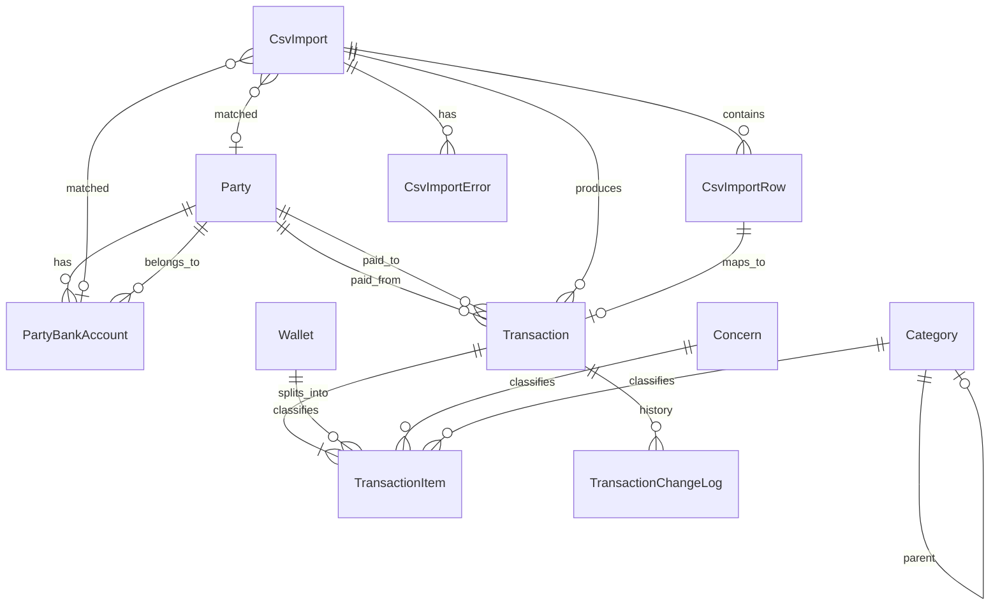

# Model domenowy SamFin

## Konteksty

| Kontekst | Odpowiedzialność |
|----------|------------------|
| **Home** | Finanse domowe: konfiguracja, import CSV, transakcje |
| **Identity** | Użytkownicy, logowanie, token API |
| **Settings** | Administracja użytkownikami |
| **System** | Health check |

## Diagram encji (rdzeń finansowy)

## Transaction (transakcja)

Reprezentuje pojedynczą operację finansową (wpływ lub wydatek) z banku lub — teoretycznie — utworzoną ręcznie.

| Atrybut | Znaczenie domenowe |
|---------|-------------------|
| `operation_date` | Data operacji |
| `description` | Opis z banku lub użytkownika |
| `amount_minor` | Kwota w groszach; znak wskazuje kierunek przy imporcie CSV |
| `direction` | `INCOME` lub `EXPENSE` |
| `status` | Postęp klasyfikacji (patrz niżej) |
| `paid_from_party` | Podmiot, od którego pochodzą środki |
| `paid_to_party` | Podmiot, do którego trafiają środki |
| `source` | `CSV` (z importu) lub `MANUAL` (stała w kodzie; brak API tworzenia) |
| `import` / `import_row` | Powiązanie z importem CSV (opcjonalne) |
| `counterparty_account_number` | NRB kontrahenta (z importu), do warunków reguł |

### Status klasyfikacji

Logika w `TransactionStatusCalculator` (wspólna dla klasyfikacji, bulk update i importu CSV).

| Status | Warunek |
|--------|---------|
| `UNCLASSIFIED` | Żadne pole klasyfikacji nie jest wypełnione: brak `paid_from`, brak `paid_to`, żadna pozycja nie ma portfela, obszaru ani kategorii |
| `PARTIALLY_CLASSIFIED` | Wypełnione jest **co najmniej jedno** pole (Skąd, Dokąd lub dowolny wymiar na pozycji), ale nie spełniony jest warunek `CLASSIFIED` |
| `CLASSIFIED` | Ustawione **oba** podmioty (`paid_from` **i** `paid_to`) **oraz** **każda** pozycja ma **wszystkie trzy** wymiary: portfel, obszar (dotyczy) i kategoria |

**Pięć pól klasyfikacji:** Skąd + Dokąd + (na każdej pozycji) portfel + dotyczy + kategoria.

## TransactionItem (pozycja transakcji)

Transakcja może być podzielona na 1–5 pozycji. Suma kwot pozycji musi równać się kwocie transakcji.

| Atrybut | Znaczenie |
|---------|-----------|
| `amount_minor` | Udział pozycji w kwocie |
| `description` | Opcjonalny opis pozycji |
| `wallet` | Portfel (dane konfigurowalne w tabeli `wallet`) |
| `concern` | Obszar „dotyczy” (dane konfigurowalne w tabeli `concern`) |
| `category` | Kategoria (dane konfigurowalne w tabeli `category`) |

## Transakcje ręczne (`SOURCE_MANUAL`) — planowane

Transakcja utworzona przez użytkownika, bez importu CSV (`source = MANUAL`, brak `import` / `import_row`).

**MVP (ADR-019):**
- Wymagane: `direction`, `operation_date`, `amount_minor`, `description`
- Opcjonalne przy tworzeniu: Skąd, Dokąd, wymiary pozycji
- Jedna domyślna pozycja (jak po imporcie CSV)
- Reguły podmiotów: ADR-017 — wydatek → Skąd tylko OWN+CASH; wpływ → Dokąd tylko OWN+CASH; druga strona — lista aktywnych podmiotów; Skąd ≠ Dokąd

**Stan:** encja i walidator gotowe; brak `POST /api/transactions` i UI tworzenia.

## Party (podmiot)

Uniwersalny byt reprezentujący stronę transakcji: osobę, firmę, sklep, instytucję, konto, gotówkę itd. **Konkretne podmioty to rekordy w tabeli**, nie stałe w kodzie.

Pola klasyfikujące (enumy w kodzie, wartości wybierane przy tworzeniu rekordu):

- `type` — typ podmiotu (np. PERSON, COMPANY, CASH, ACCOUNT…)
- `ownership_type` — OWN / EXTERNAL

### Reguły Skąd / Dokąd (kontekstowe, bez flag na podmiocie)

| Źródło | Wydatek | Wpływ |
|--------|---------|-------|
| **Import CSV** | Skąd = OWN+ACCOUNT (z rachunku), read-only | Dokąd = OWN+ACCOUNT, read-only |
| **Ręcznie** | Skąd = tylko OWN+CASH | Dokąd = tylko OWN+CASH |
| **Druga strona** | długa lista aktywnych podmiotów | j.w. |

Dodatkowo: **Skąd ≠ Dokąd**. Walidacja: `TransactionPartyAssignmentValidator`; UI: `partyAssignment.ts`.

## PartyBankAccount (rachunek bankowy podmiotu)

Łączy numer rachunku z podmiotem. Używany przy walidacji importu CSV (dopasowanie numeru z pliku do konfiguracji).

## Wallet (portfel)

**Kubełek rozliczeniowy** — wymiar klasyfikacji pozycji, nie konto bankowe i nie limit budżetowy.

| Przykład | Znaczenie |
|----------|-----------|
| Budżet domowy | Wspólne wydatki gospodarstwa |
| Salon fryzjerski | Osobny „koszyk” dla działalności |
| Firma SamSoft | Rozliczenia firmowe w ramach domowego systemu |

Przypisywany do `TransactionItem.wallet`. Wymagany dopiero gdy transakcja ma status `CLASSIFIED`. Rachunek bankowy to podmiot `Party` typu ACCOUNT + `PartyBankAccount` — inna warstwa modelu. Decyzja: ADR-018.

## Concern (obszar „dotyczy”)

Słownik konfigurowalny — kogo/czego dotyczy wydatek lub wpływ (np. Basia, wspólne). W UI etykietowany jako **„Dotyczy”**. Nie zawiera kwot planowanych.

## Category (kategoria)

Słownik konfigurowalny z hierarchią (`parent_id`).

- **DB:** `direction_expense`, `direction_income` (co najmniej jedno `true`; CHECK w migracji `20260623120000`).
- **API:** `directions: ['EXPENSE']`, `['INCOME']` lub `['EXPENSE','INCOME']`.
- **Drzewo:** kierunki dziecka ⊆ kierunki parenta.
- **Transakcja:** kategoria na pozycji musi obsługiwać `transaction.direction` (`Category::supportsDirection()`).
- **Dezaktywacja:** blokowana przy użyciu w `transaction_items`, `transaction_template` lub `classification_rule.actions_json.items` (ADR-027). Scalanie subkategorii (`POST /api/categories/merge`) przepina te referencje przed dezaktywacją źródła.
- **UI:** lista drzewiasta + panel boczny (`?panel=create|edit|move|merge&id=`); merge i przenoszenie w panelu, nie w modalu (ADR-026).

Pole `type` (pojedynczy INCOME/EXPENSE) — **usunięte** w migracji `20260623120000`.

## CsvImport / CsvImportRow / CsvImportError

Proces importu pliku CSV:

- **CsvImport** — nagłówek importu (źródło banku, status, metadane wykryte z pliku, powiązany rachunek/podmiot)
- **CsvImportRow** — surowy wiersz z pliku + wynik parsowania
- **CsvImportError** — błędy nagłówka lub wiersza

Statusy importu: `PENDING` → `VALIDATED` / `FAILED` → po uruchomieniu importu: `IMPORTED`.

Statusy wiersza: `VALIDATED`, `PARSE_ERROR`, `DUPLICATE`, `IMPORTED`.

## ClassificationRule (reguła klasyfikacji)

Automatyczne dopasowanie i klasyfikacja transakcji — zestaw per **`party_id`** (jak filtry Gmail per konto).

| Atrybut | Znaczenie |
|---------|-----------|
| `party_id` | Podmiot-właściciel zestawu reguł (zmienialny) |
| `name`, `description` | Etykieta i notatka |
| `priority`, `enabled`, `stop_on_match` | Kolejność i zachowanie |
| `conditions_json` | `{ "conditions": [ ... ] }` — warunki AND |
| `actions_json` | `{ "transaction": { ... }, "items": [ { "percent": 100, "walletId", ... } ] }` — akcje z procentem na pozycję (suma = 100) |
| `created_from_transaction_id` | Opcjonalny ślad: utworzono z transakcji #id |

Wykonanie: wyłącznie przez `TransactionClassificationService` (ADR-023). Przy imporcie: `fill_empty` (ADR-022).

**Tworzenie reguły z transakcji (UI):** W szczegółach transakcji przycisk „Utwórz regułę” (aktywny, gdy podmiot OWN jest po właściwej stronie i spełnia kryteria `ruleEligible`). Nawigacja do `/konfiguracja/reguly` z wstępnie wypełnionym formularzem: zablokowane podmiot, kierunek, strony transakcji i klasyfikacja; warunek opisu (`contains`, wartość ręczna) oraz opcjonalnie NRB kontrahenta (`equals`, tylko odczyt). Przy zapisie ustawiane jest `created_from_transaction_id`.

## TransactionChangeLog

Historia zmian klasyfikacji transakcji. Każdy wpis to snapshot JSON (podmioty + pozycje) zapisany **po** udanej klasyfikacji przez `TransactionClassificationService`. Przywracanie (`restore`) odtwarza stan ze snapshotu.

**Bulk update nie zapisuje wpisów historii** — tylko klasyfikacja pojedyncza (`PUT /transactions/{id}/items`) i restore.

## User (użytkownik)

Konta aplikacji z rolami `ADMIN` / `USER`. Token sesji (`api_token`, 64 znaki hex) wydawany przy logowaniu.

## Terminologia w kodzie vs UI

| Kod (backend/TS) | UI (PL) | Uwagi |
|------------------|---------|-------|
| `Transaction` | Transakcje | Frontend często używa „Flow” w typach (`FlowItem`, `FlowFilters`) |
| `Concern` | Dotyczy | Komunikat błędu backendu: „obszar” |
| `Party` | Podmioty | |
| `Wallet` | Portfele | |

Niespójności: [open-questions.md](open-questions.md).

## Reguły biznesowe (podsumowanie)

1. Import CSV tworzy transakcję z jedną domyślną pozycją (bez portfela, obszaru, kategorii).
2. Przy imporcie CSV podmiot z nagłówka importu (`csv_import.party`, dopasowany przez rachunek bankowy) jest automatycznie ustawiany: **wydatek** → Skąd (`paid_from`), **wpływ** → Dokąd (`paid_to`). Status liczy `TransactionStatusCalculator` (zwykle `PARTIALLY_CLASSIFIED`).
3. Duplikat przy imporcie: ta sama kombinacja party + data + kwota + opis w ramach wcześniejszego importu tego podmiotu.
4. Klasyfikacja: 1–5 pozycji, suma = kwota transakcji; podmioty Skąd/Dokąd walidowane regułami kontekstowymi (ADR-017), nie macierzą flag na podmiocie.
5. Bulk update: wymaga jednego kierunku (`direction`) dla wszystkich wybranych transakcji; kategoria musi pasować do kierunku; podmioty walidowane jak przy klasyfikacji.
6. Usunięcie importu w statusie `IMPORTED` zwraca 409.
