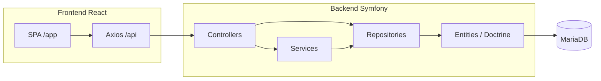

# SamFin — przegląd projektu

## Czym jest SamFin

SamFin to system budżetu domowego (home finance). Umożliwia:

- import transakcji bankowych z plików CSV,
- przeglądanie i filtrowanie transakcji,
- klasyfikację transakcji (podział na pozycje, przypisanie podmiotów, portfeli, obszarów i kategorii),
- zarządzanie słownikami konfiguracyjnymi (podmioty, rachunki bankowe, portfele, obszary, kategorie),
- reguły auto-klasyfikacji transakcji (warunki + akcje per podmiot),
- podstawowe statystyki na dashboardzie.

Aplikacja jest wieloużytkownikowa (logowanie e-mail + hasło, token API w nagłówku `Authorization: Bearer`).

## Stack technologiczny

| Warstwa | Technologie |
|---------|-------------|
| Backend | PHP 8.3+, Symfony 7, Doctrine ORM 3, MariaDB 11 |
| Frontend | React 19, TypeScript, Vite 6, React Router 7, Axios, Tailwind CSS 4 |
| Infrastruktura | Docker Compose (Apache + PHP, Node dev server, MariaDB) |

## Struktura repozytorium

```
fin/
├── backend/          # API Symfony (namespace App\)
│   ├── config/       # konfiguracja frameworka, security, doctrine
│   ├── migrations/   # migracje Doctrine (18 plików)
│   ├── public/       # document root Apache; frontend buduje się do public/app/
│   └── src/
│       ├── Home/     # domena finansowa (konfiguracja, import, transakcje)
│       ├── Identity/ # użytkownicy, autentykacja
│       ├── Settings/ # zarządzanie użytkownikami (admin)
│       └── System/   # health check
├── frontend/         # SPA React (basename /app)
├── docker/           # konfiguracja Apache, PHP
├── docs/             # dokumentacja techniczno-domenowa
├── docker-compose.yml
├── Dockerfile
└── Makefile          # skróty: up, migrate, shell, npm
```

## Uruchomienie (dev)

```bash
make setup    # build + composer install
make migrate  # migracje bazy
make up
```

- Backend API: `http://localhost:3001/api/health`
- Frontend dev: `http://localhost:5173` (proxy do API)
- Baza: MariaDB na porcie 3306, baza `samfin`

Domyślny użytkownik admin (seed migracji): `admin@samfin.local` / `admin`.

## Architektura wysokiego poziomu



## Główne przepływy biznesowe

1. **Konfiguracja** — użytkownik definiuje podmioty, rachunki bankowe, portfele, obszary (`concern`), kategorie.
2. **Import CSV** — upload pliku → parsowanie → walidacja względem konfiguracji → status VALIDATED/FAILED → ręczne uruchomienie importu → utworzenie transakcji z auto Skąd/Dokąd (podmiot z rachunku bankowego).
3. **Klasyfikacja** — użytkownik uzupełnia Skąd/Dokąd oraz pozycje (portfel, dotyczy, kategoria); status `CLASSIFIED` wymaga wszystkich pięciu pól; walidacja podmiotów wg kierunku transakcji.
4. **Reguły klasyfikacji** — zestaw reguł per podmiot OWN; ręczne uruchomienie na zaznaczeniu lub filtrze; opcjonalne tworzenie reguły z istniejącej transakcji.
5. **Dashboard** — agregaty przychodów, wydatków, salda i liczby niesklasyfikowanych transakcji.
6. **Transakcje ręczne (planowane)** — formularz tworzenia ze `source: MANUAL`; klasyfikacja opcjonalna; reguły Skąd/Dokąd jak przy edycji (ADR-017, ADR-019).

## Konwencje globalne

- **Kwoty**: przechowywane w groszach (`amount_minor`, typ `INT`); API zwraca wartości dziesiętne PLN (`round(minor / 100, 2)`).
- **Soft delete**: encje konfiguracyjne i użytkownicy dezaktywowani przez `active = false` (endpoint `DELETE` nie usuwa rekordu fizycznie).
- **Audyt**: większość encji ma `created_by`, `updated_by`, `created_at`, `updated_at`.
- **Język UI**: głównie polski; część etykiet nawigacji po angielsku (np. „Dashboard”, „Transactions”).

## Co nie jest jeszcze zaimplementowane

- Moduł raportów (strona `/raporty` to placeholder `ComingSoon`).
- Ręczne tworzenie transakcji — specyfikacja ADR-019; stała `SOURCE_MANUAL` i walidator w kodzie, brak `POST /api/transactions` i UI.
- Osobne encje na cele, beneficjentów, zakresy budżetu — nie występują w kodzie (beneficjent → `concern`; cele poza MVP).

Szczegóły: [open-questions.md](open-questions.md), [reporting.md](reporting.md).
